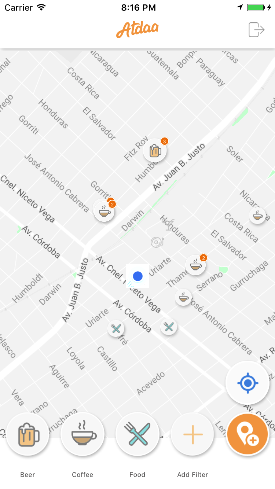
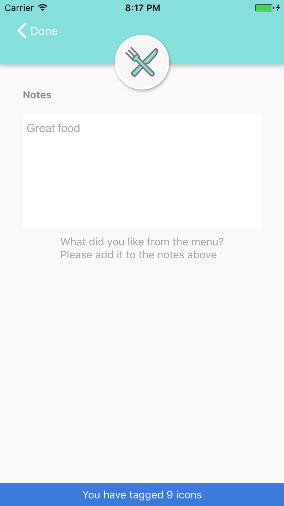

# Atdaa
Atdaa iOS Application
# React Native App [iOS]
## Description
Have you ever maintained a list of your favorite bars, restaurants, stores and clubs on a custom Google Maps only to find the interface cumbersome to use on the go and hard to share? Have you ever visited a new place and gone to a highly reviewed Yelp or Tripadvisor restaurant only to be completely underwhelmed? Atdaa solves these problems for you...because life is too short to be disappointed!

Atdaa solves these problems using a novel interface that allows you quickly search and add a place to your map with built in tags and custom notes. You can then easily get results on the go by using the filter toolbar to show the results that match exactly what your looking for. Great coffee and food on the go? Easy. What about a place that has good house music and killer cocktails close by? No sweat. 

Futhermore, we recognize that taste is a very personal thing. Mass review systems like Yelp and Trip Advisor lead to generic and diluted results that are as good as flipping a coin. Instead, it makes sense to get recommendations from the people that you trust the most. Have a friend that is a coffee snob? Follow his coffee tag and you'll immediately have his places added to your map! Is your brother a picky vegetarian? Add his food places and you'll never be stumped when trying to find a good vegetarian joint again!

## Current State
Currently Atdaa is in MVP state with only the ability to add places to your own personal map. We look forward to adding the social component in future releases and to continue to develop the tags and categories available to our users. 
## Installation Instructions
1. Clone repo
2. Download [FacebookSDK](https://origincache.facebook.com/developers/resources/?id=facebook-ios-sdk-current.zip) and extract to ~/Documents/FacebookSDK
3. open terminal and run `npm install`
4. then run `react-native link`
 * If prompted to replace Podfile say No
5. cd into ios directory
6. run `pod install`
7. Open xCode workspace file that now appears in ios directory and follow these [instructions](https://github.com/magus/react-native-facebook-login/issues/216) to update RCTFB library files
8. Build and Run
## Tech Stack
### Main Framework: React Native / Redux
### Main Libraries: react-native-maps, react-native-google-search-autocomplete
### Database: react-native-firebase
### Error logging: bugsnag-react-native
